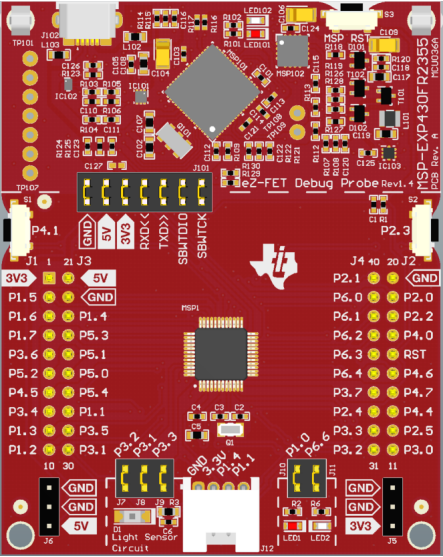

# MSP430 CCS Code Examples
Various Code Examples for the MSP430FR2355 LaunchPad Development Kit along with useful links.

# How to Use

This repository contains a list of Code Composer Studio projects. You can find a link to download CCS [here](https://www.ti.com/tool/CCSTUDIO). 
To open the projects use File > Import Projects and point it to where you downloaded this repository. It should automatically discover and list all of the projects contained within. 
After importing the projects you can then open a project and build or flash them.

## List of Examples
| Project Name          | Description   |
| ----------------------|---------------|
| 00-blink              | DOCS: Blink onboard Red LED
| 01-blinkTogether      | DOCS: Blink onboard Red and Green LEDs together
| 02-alternateBlink     | DOCS: Blink onboard Red and Green LEDs in an alternating fashion
| 03-testSwitch         | DOCS: Turn ON/OFF onboard LED using onboard Switch
| 04-switchToggle       | DOCS: Toggle the onboard LED using the onboard Switch
| 05-switchAlternate    | DOCS: Toggle between Red and Green LED using onboard Switch
| 06-switchInterrupt    | DOCS: Toggle LED using external interrupt and low power modes 
| 07-blinkWatchdog      | DOCS: Illustrates the Watchdog Timer timeout and reset 
| 08-timerBlink         | DOCS: Use internal timer and low frequency oscillator to blink onboard red LED
| 09-softwarePWM        | DOCS: Implementation of PWM using software time delays on a onboard red LED
| 10-pwmTest            | DOCS: Fading effect on external Green LED using hardware PWM
| 11-timerCapture       | DOCS: Uses the Input Capture mode of Timer to measure external signal period
| 12-adcTest            | DOCS: Reads the internal temperature sensor and converts value to Celcius
| 13-dcoTest            | DOCS: Cycles through calibrated DCO frequencies during runtime
| 14-adcPWM             | DOCS: Use ADC input to control intensity of onboard Green LED
| 15-adcPWM-lpm         | DOCS: Implementation of ADC based PWM control using low power modes
| 16-uartEcho           | DOCS: Implements UART link at a baud rate of 9600. Echoes RX char + 1
| 17-helloWorld         | DOCS: Prints the string "Hello World !" on the UART link
| 18-uartPrintNum       | DOCS: Converts an integer value to string and prints it on the UART link
| 19-uartADC            | DOCS: Displays the ADC value on the UART link
| 20-bitBangShift       | TEST: Implements SPI communication with shift register by bit banging GPIO
| 21-spiShift           | TEST: Use SPI protocol to send data to a shift register
| 22-i2cTempSensor      | TEST: Read temperature values from a LM75 sensor over I2C
| 23-helloLCD           | TEST: Connects to a 16x2 LCD using 4-bit mode, generic library .c & .h files
| 24-spiLoopback        | DOCS: Transmits byte from MOSI to MISO on the same dev board

## Dev Kit
The dev kit for the MSP430FR2355 shown below. 

There are two LEDs located on the bottom right of the board labeled 'LED1' which is the red LED and 'LED2' which is the green LED. 

There is also two buttons, on the left middle, labeled P4.1 and the right middle labeled P2.3. 

## Useful Links

[MSP430FR4xx and MSP430FR2xx family user's guide (Rev. I)](https://www.ti.com/lit/ug/slau445i/slau445i.pdf?ts=1758248219856&ref_url=https%253A%252F%252Fwww.ti.com%252Fproduct%252FMSP430FR2355) <- This has all the registers and the definition of their bits

[MSP430FR235x, MSP430FR215x Mixed-Signal Microcontrollers datasheet (Rev. D)](https://www.ti.com/lit/ds/symlink/msp430fr2355.pdf?ts=1758179932428&ref_url=https%253A%252F%252Fwww.ti.com%252Fproduct%252FMSP430FR2355) <- Has specifics about the MSP430FR2355

[MSP430FR2355 LaunchPad™ Development Kit (MSP-EXP430FR2355) User's Guide](https://www.ti.com/lit/ug/slau680/slau680.pdf) <- Has any infomation of what is in the Dev Kit 

[MSP430FR2355 device erratasheet (Rev. J)](https://www.ti.com/lit/er/slaz695j/slaz695j.pdf?ts=1758236245661) <- Errata is defined as an error in printing

## Todo

TODO: These example projects will be adapted from the forked repo, which uses the MSP430G2553 instead. Projects with 'TODO:' below have not yet been adjusted. Projects with 'TEST:' have not yet been tested. Projects with 'DOC:' have been tested to work, but probably need a second pair of eyes to add explanations where necessary. 

TODO: Explain `__bis_SR_register()` and `__bic_SR_register()` intrinsics, how it's a CPU register and thus doesn't have a memory address that can be written to like memory-mapped peripherals
